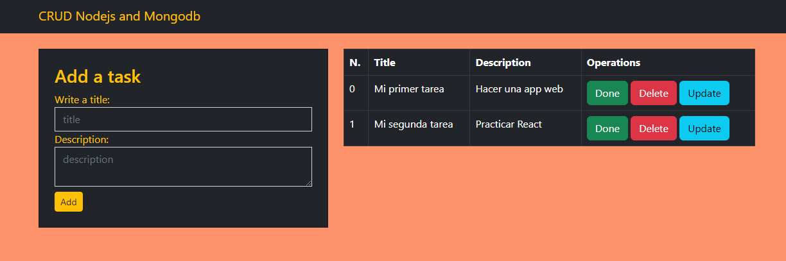
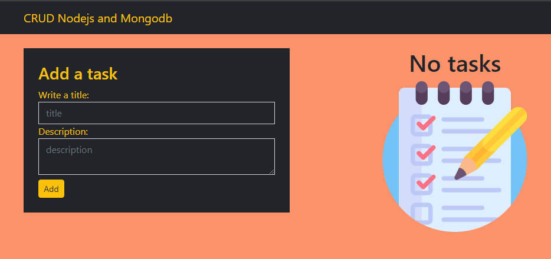

<div>
<h1 align="center"> Project: Task Notepad</h1>
&nbsp;

---
<p></p>
</div>
&nbsp;

---

 <h3 align="center"> 💻Trabajo Práctico Final - Curso Full Stack Avanzado - UTN</h3>
<h5 align="center">Task Notepad es una aplicación web que nos permite listar tareas, consultarlas, agregarlas, editarlas y eliminarlas.</h5>


&nbsp;

---

<p align="center">👩‍💻 Hecho  por el alumno:</p>

```GitHub profil ↓```
<ul>
        <li><a href="https://github.com/waltersegurado" target="_blank">Walter Javier Segurado</a></li>
</ul>
&nbsp;

---
### ¿Qué programas necesitas tener instalados?
Para que funcione ésta aplicación necesitas tener instalado Git, Visual Studio Code, NodeJS y MongoDB.-
&nbsp;

---
### Enviroment variables
<p>También puedes añadir las siguientes variables de entorno en el archivo .env:</p>
<p>MONGODB_URI</p>
<p>PORT</p>
&nbsp;

---
### ¿Cómo funciona?
<p>Primero debes clonar este repositorio, y abrirlo en tu repositorio local con Visual Studio Code.-</p>
<p>Ya en la carpeta especificada de Visual Studio Code, abres una terminal y ejecutas el comando de “mongod” que arranca el servidor de mongodb, y la dejas abierta que corra.-</p>
<p>En una segunda terminal ejecutas los comandos primero “npm init -y”, luego “npm install”, y por ultimo ejecutas el comando “npm run dev”.-</p>
<p>Abres el navegador y escribes http://localhost:3000/ y listo, puedes empezar a usar la aplicación “Task Notepad”.-</p>

&nbsp;

---

<p>💪 Se han utilizado dependencias, frameworks y base de datos aprendidos en éste curso, eligiendo NodeJS y Mongodb para ésta aplicación</p>
&nbsp;

---

&nbsp;

``` 
                                           📝 Contenido
```
   
&nbsp;

<h3 align="center">Herramientas</h3>
- [x] HTML, CSS, JavaScript, Node JS,Bootstrap, Express, Express-Handlebars, Mongoose, Morgan, Nodemon, Mongodb.-


   
&nbsp;

<h3 align="center">🎛 Funcionalidades principales</h3>
- [x] Se puede listar tareas, verlas, agregarlas, editarlas y eliminarlas.-
- [x] Posee una columna en la cual la aplicación coloca automáticamente el número de tarea.-
- [x] Además se le agregó un botón que permite seleccionar la opción "DONE" (tarea realizada) o "UNDONE" (tarea incompleta).- 
&nbsp;

 
&nbsp;

``` 
                                                  ✔️
```
 
&nbsp;

<p align="center">Task Accomplished</p>
<p align="center"></p>
 
 
&nbsp;


---
